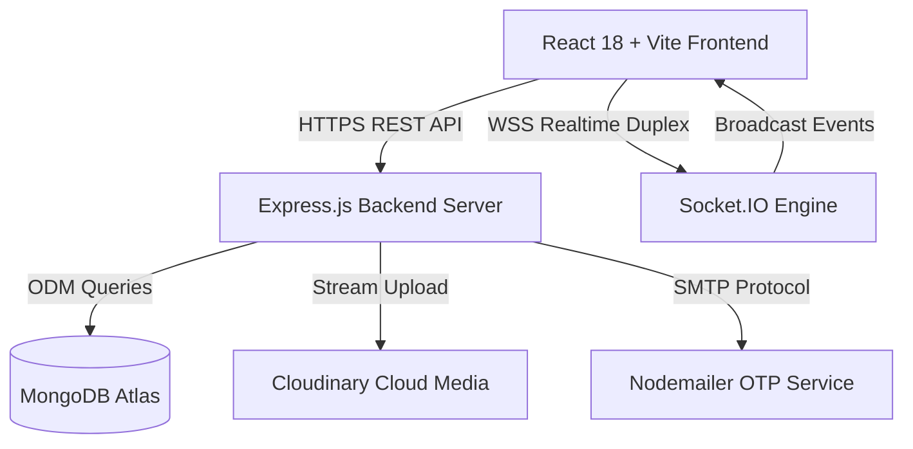

# 🔗 Bondly Social - Mạng Xã Hội & Trò Chuyện Thời Gian Thực Thế Hệ Mới

<p align="center">
  
  
  
  
  
  
  
</p>

**Bondly** là nền tảng mạng xã hội và trò chuyện thời gian thực tốc độ cao, được thiết kế theo kiến trúc Client-Server hiện đại. Ứng dụng cung cấp khả năng kết nối bạn bè, chia sẻ hình ảnh đám mây, truyền tải dữ liệu hai chiều tức thì với độ trễ cực thấp (< 25ms) qua WebSockets (Socket.IO), bảo mật xác thực JWT và giao diện người dùng **Space Dark / Cyberpunk** tinh tế.

---

## 📑 Mục Lục
1. [🌟 Tính Năng Nổi Bật](#-tính-năng-nổi-bật)
2. [🏗️ Kiến Trúc Hệ Thống](#️-kiến-trúc-hệ-thống)
3. [🛠️ Công Nghệ Sử Dụng](#️-công-nghệ-sử-dụng)
4. [📂 Cấu Trúc Thư Mục](#-cấu-trúc-thư-mục)
5. [🔌 Danh Sách RESTful API](#-danh-sách-restful-api)
6. [⚙️ Cấu Hình Biến Môi Trường (.env)](#️-cấu-hình-biến-môi-trường-env)
7. [🚀 Hướng Dẫn Cài Đặt & Chạy Dự Án](#-hướng-dẫn-cài-đặt--chạy-dự-án)
8. [👨‍💻 Tác Giả & Bản Quyền](#-tác-giả--bản-quyền)

---

## 🌟 Tính Năng Nổi Bật

### 1. ⚡ Trò Chuyện Thời Gian Thực (Socket.IO Realtime Engine)
- **Gửi & Nhận tin nhắn tức thì:** Truyền tải thông điệp hai chiều độ trễ tiệm cận 0 với WebSockets.
- **Hỗ trợ tin nhắn đa dòng:** Ô nhập liệu `<textarea>` co giãn mượt mà, hỗ trợ phím tắt `Enter` (gửi tin) và `Shift + Enter` (xuống dòng mới).
- **Trạng thái Trực tuyến (Online Presence):** Theo dõi danh sách bạn bè đang online thời gian thực.
- **Hiệu ứng Đang gõ phím (Live Typing Indicator):** Hiển thị trạng thái "đang soạn tin nhắn..." mượt mà.
- **Trạng thái Đã xem (Read Receipts):** Đánh dấu tin nhắn đã gửi (1 tick) và đã đọc (2 tick xanh).
- **Cơ chế Xóa Mềm & Thu Hồi An Toàn:**
  - **Thu hồi tin nhắn (`deletedAll`):** Đánh dấu thu hồi trên toàn bộ thành viên trong cuộc trò chuyện nhưng vẫn lưu vết an toàn trong database.
  - **Xóa một bên (`deletedFor`):** Ẩn tin nhắn ở phía người xóa mà người nhận vẫn đọc được, hỗ trợ khả năng hoàn tác.
  - **Hộp thoại xác nhận (`ConfirmModal`):** Cảnh báo xác nhận rõ ràng trước khi thực hiện xóa hoặc thu hồi.
- **Thả cảm xúc Emoji (Reactions):** Tương tác nhanh với các biểu tượng cảm xúc (❤️, 👍, 😂, 🔥, 🎉).
- **Âm thanh thông báo Web Audio API:** Tạo âm thanh thông báo tổng hợp bằng Web Audio API mượt mà không phụ thuộc file mp3 ngoài.

### 2. ☁️ Lưu Trữ Đám Mây & Trình Xem Ảnh Phóng To (Cloudinary & Lightbox)
- **Lưu trữ Cloudinary:** Tải ảnh đại diện và ảnh đính kèm trong chat trực tiếp lên đám mây Cloudinary, chỉ lưu link HTTPS trong MongoDB giúp database luôn tinh gọn và nhẹ nhàng.
- **Trình xem ảnh toàn màn hình (`ImageViewerModal`):** Bấm vào bất kỳ ảnh nào (ảnh trong chat, avatar cá nhân, avatar bạn chat) để mở lightbox phóng to sắc nét, kèm nút tải ảnh về máy và phím tắt `ESC`.

### 3. 👥 Quản Lý Bạn Bè & Tìm Kiếm Trực Tiếp
- **Tìm kiếm Live trên Header:** Tích hợp ô tìm kiếm người dùng ngay trên thanh Navbar khi đã đăng nhập, tự động debounce và hiển thị popup gợi ý kết quả kèm nút "Nhắn tin" mở ngay phòng chat.
- **Vòng đời Lời mời kết bạn:** Gửi yêu cầu kết bạn, chấp nhận, từ chối hoặc hủy yêu cầu đã gửi.
- **Hồ sơ cá nhân & Danh bạ:** Xem thông tin chi tiết (bio, email, status) và quản lý bạn bè tiện lợi.

### 4. 🌐 Web Đa Trang Chuẩn SEO & Giao Diện Cao Cấp
- **Đa trang chuẩn SEO:** 
  - Trang Chủ (`/`): Landing Page giới thiệu, trình mô phỏng chat `Bondly Simulator`.
  - Khám Phá (`/explore`): Khám phá các kênh trò chuyện cộng đồng theo chủ đề.
  - Kiến Trúc (`/features`): Phân tích kỹ thuật WebSockets vs HTTP Polling và so sánh hiệu năng.
  - Cài Đặt (`/settings`): Cập nhật hồ sơ, avatar Cloudinary và cấu hình âm thanh.
  - Phòng Chat (`/chat`): Không gian trò chuyện chính.
- **Hiệu ứng Chuyển trang mượt mà (Page Transitions):** Lướt trang êm ái với `pageFade` 0.2s.
- **Giao diện Responsive Di Động:** Tự động tối ưu giao diện trên màn hình nhỏ `< 768px` với thanh Sidebar ẩn hiện thông minh và nút quay lại (`<`).

---

## 🏗️ Kiến Trúc Hệ Thống



---

## 🛠️ Công Nghệ Sử Dụng

### Backend
- **Nền tảng:** Node.js (v18+)
- **Framework:** Express.js (v4.19)
- **Realtime Server:** Socket.IO (v4.8.1)
- **Database & ODM:** MongoDB Atlas & Mongoose (v8.2.0)
- **Cloud Storage:** Cloudinary SDK v2 & Multer
- **Xác thực:** JSON Web Token (`jsonwebtoken`), Mã hóa mật khẩu `bcryptjs`
- **Dịch vụ Email:** Nodemailer (SMTP Service)

### Frontend
- **Thư viện chính:** React 18 SPA
- **Công cụ Build:** Vite 6
- **Realtime Client:** Socket.IO Client
- **Điều hướng:** React Router DOM v6
- **Bộ icon:** Lucide React
- **Thiết kế & Styling:** Vanilla CSS Custom Properties, Space Dark Theme & Glassmorphism

---

## 📂 Cấu Trúc Thư Mục

```text
SocialMedia/
├── Backend/
│   ├── src/
│   │   ├── config/           # Cấu hình Cloudinary, Nodemailer, Database
│   │   ├── controllers/      # Bộ điều khiển API (Auth, Chat, Friend, User, Upload)
│   │   ├── middlewares/      # Middleware xác thực JWT và bảo mật
│   │   ├── models/           # Mongoose Schema (User, Message, Conversation, FriendRequest)
│   │   ├── routes/           # Định tuyến REST API
│   │   ├── services/         # Tầng xử lý nghiệp vụ CSDL và Cloudinary Stream
│   │   ├── socket/           # Động cơ Socket.IO Server & Realtime Event Handlers
│   │   └── utils/            # Tiện ích phản hồi chuẩn hóa responseOK / responseNG
│   ├── index.js              # Entrypoint khởi chạy HTTP + Socket.IO Server
│   ├── .env                  # Biến môi trường Backend
│   └── package.json
│
├── Frontend/
│   ├── src/
│   │   ├── api/              # HTTP Client tự động gắn Bearer Token & Upload helper
│   │   ├── components/       
│   │   │   ├── chat/         # Khung ChatArea, Sidebar, ProfileDrawer
│   │   │   ├── layout/       # Navbar Header (Live Search), Footer
│   │   │   ├── modals/       # ImageViewerModal, ConfirmModal, FriendModals, SearchModals
│   │   │   └── common/       # Toast, LoadingSpinner, SoundboardWidget
│   │   ├── context/          # State toàn cục (AuthContext, SocketContext, ThemeContext)
│   │   ├── pages/            # HomePage, ExplorePage, FeaturesPage, SettingsPage, ChatPage...
│   │   ├── styles/           # Hệ thống CSS Design System & Keyframe Animations
│   │   ├── App.jsx           # Quản lý Route Guards & Hiệu ứng chuyển trang PageTransition
│   │   └── main.jsx          # Entrypoint ứng dụng
│   ├── index.html            # HTML Shell & Meta Tags SEO
│   ├── vite.config.js
│   ├── .env                  # Cấu hình môi trường chạy máy cục bộ
│   ├── .env.production       # Cấu hình môi trường đóng gói deploy Production
│   └── package.json
│
└── README.md
```

---

## 🔌 Danh Sách RESTful API

### 1. Xác thực & Tài khoản (`/api/auth`)
| Phương thức | Endpoint | Mô tả |
| :--- | :--- | :--- |
| `POST` | `/api/auth/register` | Đăng ký tài khoản và gửi mã OTP qua email |
| `POST` | `/api/auth/verify-email` | Xác thực mã OTP 6 số kích hoạt tài khoản |
| `POST` | `/api/auth/login` | Đăng nhập hệ thống và cấp JWT token |
| `GET` | `/api/auth/me` | Lấy thông tin tài khoản đang đăng nhập |
| `POST` | `/api/auth/logout` | Đăng xuất tài khoản và xóa phiên làm việc |

### 2. Quản lý Tin nhắn & Hội thoại (`/api/chat`)
| Phương thức | Endpoint | Mô tả |
| :--- | :--- | :--- |
| `GET` | `/api/chat/conversations` | Lấy danh sách các cuộc trò chuyện của người dùng |
| `GET` | `/api/chat/conversations/partner/:partnerId` | Lấy hoặc khởi tạo hội thoại nháp với bạn chat |
| `GET` | `/api/chat/messages/:conversationId` | Lấy lịch sử tin nhắn kèm phân trang |
| `POST` | `/api/chat/messages` | Gửi tin nhắn mới qua REST API |
| `PUT` | `/api/chat/messages/read/:conversationId` | Đánh dấu đã đọc tất cả tin nhắn trong hội thoại |
| `PUT` | `/api/chat/messages/recall/:messageId` | Thu hồi tin nhắn với tất cả mọi người (`deletedAll`) |
| `DELETE` | `/api/chat/messages/delete-for-me/:messageId` | Xóa tin nhắn một bên ở phía người dùng (`deletedFor`) |
| `POST` | `/api/chat/messages/react/:messageId` | Thả biểu tượng cảm xúc Emoji vào tin nhắn |

### 3. Tải Lên Đám Mây (`/api/upload`)
| Phương thức | Endpoint | Mô tả |
| :--- | :--- | :--- |
| `POST` | `/api/upload/avatar` | Tải ảnh đại diện người dùng lên Cloudinary |
| `POST` | `/api/upload/image` | Tải ảnh đính kèm tin nhắn chat lên Cloudinary |

### 4. Quản lý Bạn bè (`/api/friend-request`)
| Phương thức | Endpoint | Mô tả |
| :--- | :--- | :--- |
| `GET` | `/api/friend-request/friends` | Lấy danh sách bạn bè hiện tại |
| `GET` | `/api/friend-request/received` | Lấy danh sách lời mời kết bạn nhận được |
| `GET` | `/api/friend-request/sent` | Lấy danh sách lời mời kết bạn đã gửi |
| `POST` | `/api/friend-request/send/:receiverId` | Gửi lời mời kết bạn |
| `PUT` | `/api/friend-request/accept/:requestId` | Chấp nhận lời mời kết bạn |
| `PUT` | `/api/friend-request/reject/:requestId` | Từ chối lời mời kết bạn |
| `DELETE` | `/api/friend-request/unfriend/:friendId` | Hủy kết bạn |

---

## ⚙️ Cấu Hình Biến Môi Trường (.env)

### 1. Cấu hình Backend (`Backend/.env`)
```env
PORT=3002
MONGO_URL=mongodb+srv://<username>:<password>@cluster0.mongodb.net/community_db
JWT_SECRET=your_super_jwt_secret_key_here

# Cho phép kết nối CORS từ Frontend (có thể ngăn cách bằng dấu phẩy)
URL_FE=http://localhost:5173,https://bondly.vercel.app

# Cấu hình lưu trữ đám mây Cloudinary
CLOUD_NAME=dmjlors75
CLOUD_API_KEY=459761311476328
CLOUD_API_SECRET=bJv8doQTrE_4Cf6FQPe4fFm8jvw

# Cấu hình gửi mail OTP Nodemailer
EMAIL_USER=your_email@gmail.com
EMAIL_PASS=your_app_password
```

### 2. Cấu hình Frontend (`Frontend/.env` hoặc `.env.production`)
```env
# URL kết nối REST API Backend
VITE_API_URL=http://localhost:3002/api

# URL kết nối máy chủ Realtime Socket.IO
VITE_SOCKET_URL=http://localhost:3002
```

---

## 🚀 Hướng Dẫn Cài Đặt & Chạy Dự Án

### 1. Khởi chạy Backend Server
```bash
cd Backend
npm install
npm run dev
```
> Backend sẽ chạy tại cổng: `http://localhost:3002`

### 2. Khởi chạy Frontend Client
```bash
cd Frontend
npm install
npm run dev
```
> Mở trình duyệt và truy cập tại: `http://localhost:5173`

---

## 👨‍💻 Tác Giả & Bản Quyền
- **Lập trình viên:** Nguyễn (Nguyenne Dev)
- **Email liên hệ:** [nguyenne.dev@gmail.com](mailto:nguyenne.dev@gmail.com)
- **Bản quyền:** © 2025 - 2026 **Bondly Social Platform**. Mọi quyền được bảo lưu.
